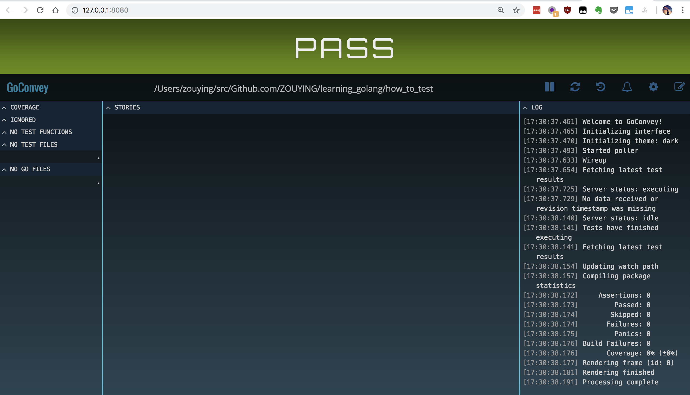

# HOW TO TESTING


## 原始代码

代码功能：访客记次数。

```go
package main

import (
	"fmt"
	"log"
	"net/http"
)

var counter = map[string]int{}

func handleHello(w http.ResponseWriter, r *http.Request) {
	name := r.FormValue("name")
	counter[name]++

	w.Header().Set("Content-Type", "text/html; charset=utf-8")
	w.Write([]byte("<h1 style='color: " + r.FormValue("color") +
		"'>Welcome!</h1> <p>Name: " + name + "</p> <p>Count: " + fmt.Sprint(counter[name]) + "</p>"))
}

func main() {
	http.HandleFunc("/hello", handleHello)
	log.Fatal(http.ListenAndServe(":8080", nil))
}
```


运行：

```bash
go run main.go
```


浏览器访问：


本地日志记录：


### 测试规范

1. 运行测试：

   1. 测试：`go test`
   2. 压力测试：`go test -bench`
   3. 测试覆盖：`go test -cover`

2. 测试规范：

   1. 测试函数示例

      ```go
      // go test or go test -v
      func TestXxx(*testing.T)
      
      // go test -bench
      func BenchmarkXxx(*testing.B)
      ```

      Xxx不能以小写字母开头。

   2. 测试文件规范：文件名以`_test.go`结尾。

   3. 在测试函数里面使用：Error，Fail或者相关的函数标示相关错误。

3. 例子：

   1. 单元测试：

      ```go
      func TestTimeConsuming(t *testing.T) {
          if testing.Short() {
              t.Skip("skipping test in short mode.")
          }
          ...
      }
      ```

   2. 压力测试：

      ```go
      func BenchmarkHello(b *testing.B) {
          for i := 0; i < b.N; i++ {
              fmt.Sprintf("hello")
          }
      }
      ```

   3. Examples：

      ```go
      func ExampleHello() {
          fmt.Println("hello")
          // Output: hello
      }
      
      func ExampleSalutations() {
          fmt.Println("hello, and")
          fmt.Println("goodbye")
          // Output:
          // hello, and
          // goodbye
      }
      ```


### 测试用例


**运行测试**

使用`go test`运行测试。

```bash
➜  how_to_test git:(how_to_test) ✗ go test
?       _/Users/zouying/src/Github.com/ZOUYING/learning_golang/how_to_test      [no test files]
```


> 也可以使用Golang的TDD小工具：`goconvey`
>
> 安装：`go get github.com/smartystreets/goconvey`
>
> 介绍: [GoConvey is awesome Go testing](https://github.com/smartystreets/goconvey)
>
> 运行：`goconvey`
>
> 效果截图：
>
> 


**测试用例**

创建`main_test.go`，

```bash
touch main_test.go
```

编写第一个测试用例：

```go
func TestHandleRoot_Recorder(t *testing.T) {
	rw := httptest.NewRecorder()
	name := "zouying"
	req := httptest.NewRequest(http.MethodPost, "/hello?name="+name, nil)
	handleHello(rw, req)

	if rw.Code != http.StatusOK {
		t.Errorf("status code not ok, status code is %v", rw.Code)
	}

	if len(counter) != 1 {
		t.Errorf("counter len not correct")
	}

	if counter[name] != 1 {
		t.Errorf("counter value is error: visitor=%s count=%v", name, counter[name])
	}
}
```


运行测试：`go test -v`：

> ➜  how_to_test git:(how_to_test) ✗ go test -v
> === RUN   TestHandleRoot_Recorder
> INFO[0000] visited                                       count=1 module=main name=zouying
> --- PASS: TestHandleRoot_Recorder (0.00s)
> PASS
> ok      _/Users/zouying/src/Github.com/ZOUYING/learning_golang/how_to_test      0.015s


运行测试覆盖：`go test -cover`

> ➜  how_to_test git:(how_to_test) ✗ go test -cover
> INFO[0000] visited                                       count=1 module=main name=zouying
> PASS
> coverage: 62.5% of statements
> ok      _/Users/zouying/src/Github.com/ZOUYING/learning_golang/how_to_test      0.021s


查看覆盖的代码：

```bash
#!/bin/bash
go test -coverprofile=coverage.out
go tool cover -html=coverage.out
```


> ➜  how_to_test git:(how_to_test) ✗ go test -coverprofile=/tmp/coverage.out
> INFO[0000] visited                                       count=1 module=main name=zouying
> PASS
> coverage: 62.5% of statements
> ok      _/Users/zouying/src/Github.com/ZOUYING/learning_golang/how_to_test      0.015s
> ➜  how_to_test git:(how_to_test) ✗ go tool cover -html=/tmp/coverage.out

效果图为：


绿色的表示测试代码覆盖住的，红色的表示没有覆盖。


第一个测试用例是直接测试http处理函数，我们使用了`httptest.NewRecorder()`创建`ResponseRecorder`对象，其中实现了 `ResponseWriter interface`。该对象在内存中记录了http response的状态。


还有一种测试方法是运行一个HTTP Server，使用HTTP Client请求该Server对应的接口。

httptest package中提供了`NewServer`方法，监听HandlerFunc处理函数，启动Server，启动Server的地址通过`URL`成员获得，例如：`http://127.0.0.1:52412`。需要注意的是，使用完毕后记得调用关闭：`Close()`。


具体参考：

- https://golang.org/pkg/testing/