# HOW TO TUNING

介绍使用Benchmark进行调优。

- 如何写压测示例；
- 如何使用压测程序进行调优；


## 原始代码

代码功能：访客记次数。

```go
package main

import (
	"fmt"
	"net/http"
	"sync"

	"github.com/sirupsen/logrus"
)

var counter = map[string]int{}
var mu sync.Mutex // mutex for counter

func handleHello(w http.ResponseWriter, r *http.Request) {
	name := r.FormValue("name")
	mu.Lock()
	defer mu.Unlock()
	counter[name]++

	w.Header().Set("Content-Type", "text/html; charset=utf-8")
	w.Write([]byte("<h1 style='color: " + r.FormValue("color") +
		"'>Welcome!</h1> <p>Name: " + name + "</p> <p>Count: " + fmt.Sprint(counter[name]) + "</p>"))

	logrus.WithFields(logrus.Fields{
		"module": "main",
		"name":   name,
		"count":  counter[name],
	}).Infof("visited")
}

func main() {
	logrus.SetFormatter(&logrus.JSONFormatter{})

	http.HandleFunc("/hello", handleHello)
	logrus.Fatal(http.ListenAndServe(":8080", nil))
}
```


上一次讲了如何进行普通的测试，这次对`handleHello`处理函数编写压力测试示例。

```go
func BenchmarkHandleFunc(b *testing.B) {
	logrus.SetOutput(ioutil.Discard)  // 抛弃日志

	rw := httptest.NewRecorder()
	req := httptest.NewRequest(http.MethodPost, "/hello?name=zouying", nil)

	for i := 0; i < b.N; i++ {
		handleHello(rw, req)
	}
}
```


运行压测用例：

```bash
➜  how_to_tuning git:(master) ✗ go test -bench .
goos: darwin
goarch: amd64
BenchmarkHandleFunc-8             300000              4116 ns/op
PASS
ok      _/Users/zouying/src/Github.com/ZOUYING/learning_golang/how_to_tuning    1.319s
```


或者增加`-benchmem`选项，显示内存信息，

```bash
➜  how_to_tuning git:(master) ✗ go test -bench . -benchmem
goos: darwin
goarch: amd64
BenchmarkHandleFunc-8             300000              4297 ns/op            1411 B/op         25 allocs/op
PASS
ok      _/Users/zouying/src/Github.com/ZOUYING/learning_golang/how_to_tuning    1.368s
```

或者在测试用例中的最开始，增加下列代码，也可以显示内存信息。

```go
b.ReportAllocs()
```

每个压测用例默认的压测时常大概在1秒钟，如果我们需要压测的时间长一些的话，那么可以在运行的时候，加上`-benchtime=5s`的参数，5s表示5秒。


## Golang调优

### 背景

- Robert Hundt在2011年Scala Day发表了一篇论文，论文叫：[Loop Recognition in C++/Java/Go/Scala](https://ai.google/research/pubs/pub37122)，大概讲的就是论文中的Go程序运行的非常慢。

- Go团队就使用`go tool pprof`进行了优化，具体参见：[profiling-go-programs](https://blog.golang.org/profiling-go-programs)。结果为：

  - 速度巨大提升（*magnitude faster*）
  - 6倍的内存降低（*use 6x less memory*）

- 重现论文程序。在论文中虽然比对了四种语言，但由于go团队的人没有足够的Java和Scala的优化能力，所以只进行了Go和C++具体比对。

  >  具体的软件、硬件如下：
  >
  > ```bash
  > $ go version
  > go version devel +08d20469cc20 Tue Mar 26 08:27:18 2013 +0100 linux/amd64
  > $ g++ --version
  > g++ (GCC) 4.8.0
  > Copyright (C) 2013 Free Software Foundation, Inc.
  > ...
  > $
  > ```
  >
  > ```
  > 硬件：
  > 
  > 3.4GHz Core i7-2600 CPU and 16 GB of RAM running Gentoo Linux's 3.8.4-gentoo kernel
  > ```
  >
  > **调优前，重现论文程序的结果。**
  >
  > 具体结果：

  > ```bash
  > $ cat xtime
  > #!/bin/sh
  > /usr/bin/time -f '%Uu %Ss %er %MkB %C' "$@"
  > $
  > 
  > $ make havlak1cc
  > g++ -O3 -o havlak1cc havlak1.cc
  > $ ./xtime ./havlak1cc
  > # of loops: 76002 (total 3800100)
  > loop-0, nest: 0, depth: 0
  > 17.70u 0.05s 17.80r 715472kB ./havlak1cc
  > $
  > 
  > $ make havlak1
  > go build havlak1.go
  > $ ./xtime ./havlak1
  > # of loops: 76000 (including 1 artificial root node)
  > 25.05u 0.11s 25.20r 1334032kB ./havlak1
  > $
  > ```
  >
  > 输出参数为：`u: user time`, `s: system time`,`r: real time`
  >
  > C++程序运行了17.80s，使用内存700MB；
  >
  > Go程序是运行了25.20s，使用内存1302MB；

  - 最终优化版本

    > 运行2.29s，使用内存：351MB；提升了11倍；
    >
    > ```bash
    > $ make havlak6
    > go build havlak6.go
    > $ ./xtime ./havlak6
    > # of loops: 76000 (including 1 artificial root node)
    > 2.26u 0.02s 2.29r 360224kB ./havlak6
    > $
    > ```
    >
    > 

  - 按照Go相同的思路，实现了一遍C++相同的代码，具体代码参见：[C++版本代码](https://github.com/rsc/benchgraffiti/blob/master/havlak/havlak6.cc)

    > 耗时：2.19s，379MB内存；
    >
    > ```bash
    > $ make havlak6cc
    > g++ -O3 -o havlak6cc havlak6.cc
    > $ ./xtime ./havlak6cc
    > # of loops: 76000 (including 1 artificial root node)
    > 1.99u 0.19s 2.19r 387936kB ./havlak6cc
    > ```

  - 代码源码参考：

    - [c++](https://github.com/rsc/benchgraffiti/blob/master/havlak/havlak6.cc)
    - [go](https://github.com/rsc/benchgraffiti/blob/master/havlak/havlak6.go)


### Golang自带的调优库: pprof

- runtime/pprof：输出runtime的profiling数据，写到指定文件中，而该文件可以被一些pprof tool打开。

  - 使用benchmark

    > ```bash
    > # 输出cpu profile和memory profile
    > go test -cpuprofile cpu.prof -memprofile mem.prof -bench .
    > ```

  - 标准的程序

    > ```go
    > var cpuprofile = flag.String("cpuprofile", "", "write cpu profile to `file`")
    > var memprofile = flag.String("memprofile", "", "write memory profile to `file`")
    > 
    > func main() {
    >     flag.Parse()
    >     if *cpuprofile != "" {
    >         f, err := os.Create(*cpuprofile)
    >         if err != nil {
    >             log.Fatal("could not create CPU profile: ", err)
    >         }
    >         if err := pprof.StartCPUProfile(f); err != nil {
    >             log.Fatal("could not start CPU profile: ", err)
    >         }
    >         defer pprof.StopCPUProfile()
    >     }
    > 
    >     // ... rest of the program ...
    > 
    >     if *memprofile != "" {
    >         f, err := os.Create(*memprofile)
    >         if err != nil {
    >             log.Fatal("could not create memory profile: ", err)
    >         }
    >         runtime.GC() // get up-to-date statistics
    >         if err := pprof.WriteHeapProfile(f); err != nil {
    >             log.Fatal("could not write memory profile: ", err)
    >         }
    >         f.Close()
    >     }
    > }
    > ```

- net/http/pprof：也可以通过HTTP server获取到runtime profiling data，一般如果是http服务的话，可以直接挂在到对应的http handler上，然后通过访问`/debug/pprof/`开头的路径，进行进行相应数据的访问。

  > ```go
  > import _ "net/http/pprof"
  > 
  > go func() {
  > 	log.Println(http.ListenAndServe("localhost:6060", nil))
  > }()
  > ```
  >
  > ```bash
  > # 查看heap profile
  > go tool pprof http://localhost:6060/debug/pprof/heap
  > 
  > # 查看30s CPU profile
  > go tool pprof http://localhost:6060/debug/pprof/profile?seconds=30
  > 
  > # 检查blocking profile，需要设置首先调用runtime.SetBlockProfileRate
  > go tool pprof http://localhost:6060/debug/pprof/block
  > 
  > # 收集5s的trace数据
  > wget http://localhost:6060/debug/pprof/trace?seconds=5
  > ```

* 打开收集到的profile

  * golang pprof tool

    ```bash
    go tool pprof cpu.prof
    ```

  * 第三方的pprof tool

    * uber火焰图，火焰图效果如下，

      > 使用火焰图打开profile，
      >
      > ```bash
      > ➜  how_to_tuning git:(master) ✗ go-torch /tmp/5_cpu.prof
      > INFO[23:12:40] Run pprof command: go tool pprof -raw -seconds 30 /tmp/5_cpu.prof
      > INFO[23:12:41] Writing svg to torch.svg
      > ```
      >
      > 
      >
      > 使用chrome浏览器打开`torch.svg`，
      >
      > 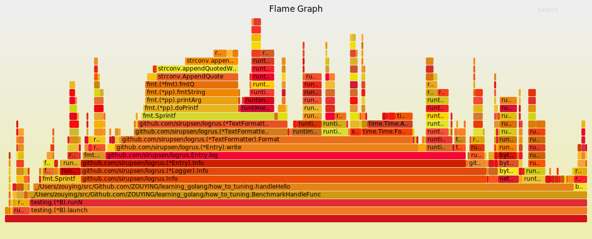
      >
      > 
      >
      > 生成内存火焰图，
      >
      > ```bash
      > ➜  how_to_tuning git:(master) ✗ go-torch --alloc_objects /tmp/5_mem.prof
      > INFO[23:17:53] Run pprof command: go tool pprof -raw -seconds 30 --alloc_objects /tmp/5_mem.prof
      > INFO[23:17:54] Writing svg to torch.svg
      > ```
      >
      > 
      >
      > 打开内存火焰图，
      >
      > 


如何使用工具：

- topN：默认显示flat Top 10的函数，可以加`-cum`统计总的消耗；
- list Func：显示函数每行代码的采样分析；
- web：生成svg热点图片
- weblist：生成svg list代码采样分析；


## CPU调优

原理：

每秒钟100次的数据状态采样，根据经验值，默认100Hz比较合理，一般不能大于500Hz。技能产生足够有效的数据，也不至于让系统产生卡顿。

相关的定义在[StartCPUProfile()](https://golang.org/src/runtime/pprof/pprof.go#L740)

```go
func StartCPUProfile(w io.Writer) error {
	// The runtime routines allow a variable profiling rate,
	// but in practice operating systems cannot trigger signals
	// at more than about 500 Hz, and our processing of the
	// signal is not cheap (mostly getting the stack trace).
	// 100 Hz is a reasonable choice: it is frequent enough to
	// produce useful data, rare enough not to bog down the
	// system, and a nice round number to make it easy to
	// convert sample counts to seconds. Instead of requiring
	// each client to specify the frequency, we hard code it.
	const hz = 100

	// ...
    runtime.SetCPUProfileRate(hz)
	go profileWriter(w)
	return nil
}
```


启动压测时，我们加入`-cpuprofile`参数选项，可以生成

```bash
➜  how_to_tuning git:(master) ✗ go test -bench . -cpuprofile=/tmp/cpu.prof
goos: darwin
goarch: amd64
BenchmarkHandleFunc-8             300000              4671 ns/op            1411 B/op         25 allocs/op
PASS
ok      _/Users/zouying/src/Github.com/ZOUYING/learning_golang/how_to_tuning    1.655s
```


打开生成的cpu profile文件，使用`topN`，或者使用`topN -cum`

* 使用top打开耗时最大的的函数，但是不包括调用子函数的消耗
* 使用top -cum会包括调用子函数的消耗，是一个累积的过程

```bash
➜  how_to_tuning git:(master) ✗ go tool pprof /tmp/cpu.prof
Type: cpu
Time: Jan 12, 2019 at 11:12pm (CST)
Duration: 2.74s, Total samples = 2.29s (83.46%)
Entering interactive mode (type "help" for commands, "o" for options)
(pprof) top10
Showing nodes accounting for 890ms, 38.86% of 2290ms total
Dropped 54 nodes (cum <= 11.45ms)
Showing top 10 nodes out of 124
      flat  flat%   sum%        cum   cum%
     140ms  6.11%  6.11%      140ms  6.11%  runtime.memclrNoHeapPointers
     130ms  5.68% 11.79%      670ms 29.26%  runtime.mallocgc
     120ms  5.24% 17.03%      290ms 12.66%  runtime.mapassign_faststr
     110ms  4.80% 21.83%      180ms  7.86%  time.Time.AppendFormat
      80ms  3.49% 25.33%       80ms  3.49%  runtime.kevent
      80ms  3.49% 28.82%      100ms  4.37%  runtime.mapiternext
      70ms  3.06% 31.88%       70ms  3.06%  runtime.stkbucket
      60ms  2.62% 34.50%     1070ms 46.72%  github.com/sirupsen/logrus.(*TextFormatter).Format
      50ms  2.18% 36.68%       50ms  2.18%  cmpbody
      50ms  2.18% 38.86%       80ms  3.49%  runtime.heapBitsSetType
(pprof)


(pprof) top 10 -cum
Showing nodes accounting for 0.26s, 11.35% of 2.29s total
Dropped 54 nodes (cum <= 0.01s)
Showing top 10 nodes out of 124
      flat  flat%   sum%        cum   cum%
         0     0%     0%      2.12s 92.58%  _/Users/zouying/src/Github.com/ZOUYING/learning_golang/how_to_tuning.BenchmarkHandleFunc
     0.02s  0.87%  0.87%      2.12s 92.58%  _/Users/zouying/src/Github.com/ZOUYING/learning_golang/how_to_tuning.handleHello
         0     0%  0.87%      2.12s 92.58%  testing.(*B).launch
         0     0%  0.87%      2.12s 92.58%  testing.(*B).runN
     0.01s  0.44%  1.31%      1.39s 60.70%  github.com/sirupsen/logrus.(*Entry).Infof
     0.02s  0.87%  2.18%      1.28s 55.90%  github.com/sirupsen/logrus.(*Entry).Info
     0.02s  0.87%  3.06%      1.23s 53.71%  github.com/sirupsen/logrus.Entry.log
         0     0%  3.06%      1.10s 48.03%  github.com/sirupsen/logrus.(*Entry).write
     0.06s  2.62%  5.68%      1.07s 46.72%  github.com/sirupsen/logrus.(*TextFormatter).Format
     0.13s  5.68% 11.35%      0.67s 29.26%  runtime.mallocgc
```

- flat：时间，但是不包括子函数运行时间；
- cum：包括自函数运行的时间；


运行`list handleHello`查看handleHello函数的状态：

```bash
(pprof) list handleHello
Total: 2.29s
ROUTINE ======================== _/Users/zouying/src/Github.com/ZOUYING/learning_golang/how_to_tuning.handleHello in /Users/zouying/src/Github.com/ZOUYING/learning_golang/how_to_tuning/main.go
      20ms      2.12s (flat, cum) 92.58% of Total
         .          .     12:var mu sync.Mutex // mutex for counter
         .          .     13:
         .          .     14:func handleHello(w http.ResponseWriter, r *http.Request) {
         .          .     15:   name := r.FormValue("name")
         .          .     16:   mu.Lock()
         .       20ms     17:   counter[name]++
         .          .     18:   cnt := counter[name]
         .       10ms     19:   mu.Unlock()
         .          .     20:
         .       70ms     21:   w.Header().Set("Content-Type", "text/html; charset=utf-8")
         .      120ms     22:   w.Write([]byte("<h1 style='color: " + r.FormValue("color") +
      10ms       70ms     23:           "'>Welcome!</h1> <p>Name: " + name + "</p> <p>Count: " + fmt.Sprint(cnt) + "</p>"))
         .          .     24:
         .      390ms     25:   logrus.WithFields(logrus.Fields{
      10ms       10ms     26:           "module": "main",
         .       30ms     27:           "name":   name,
         .       10ms     28:           "count":  cnt,
         .      1.39s     29:   }).Infof("visited")
         .          .     30:}
         .          .     31:
         .          .     32:func main() {
         .          .     33:   logrus.SetFormatter(&logrus.JSONFormatter{})
         .          .     34:
```


运行`web`使用浏览器打开，示例如下，

```bash
(pprof) web
(pprof) web handleHello
```

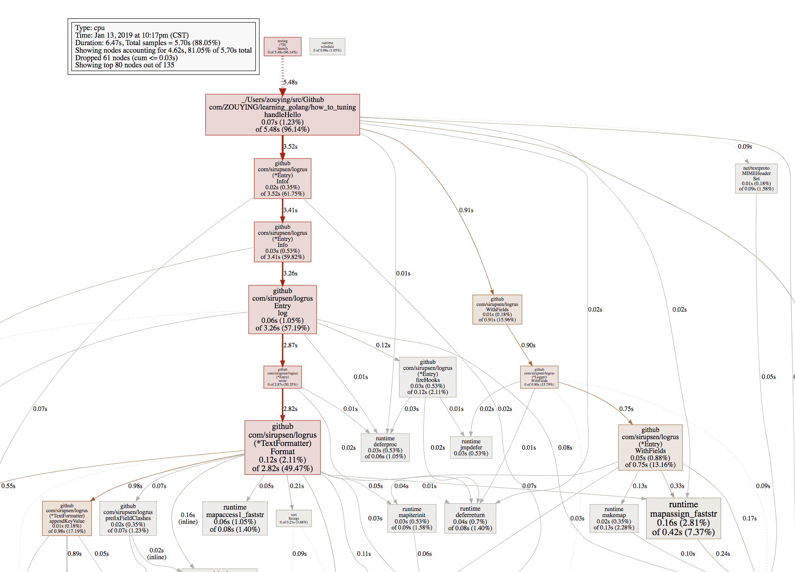

- 框越大/颜色越红 表示消耗越多/大
- 连接线表示函数调用，连接线上的参数表示调用子函数的消耗（类似于-cum）


也可以使用`weblist`或者`weblist handleHello`打开web版本的list，查看具体每一行代码的消耗。示例如下，

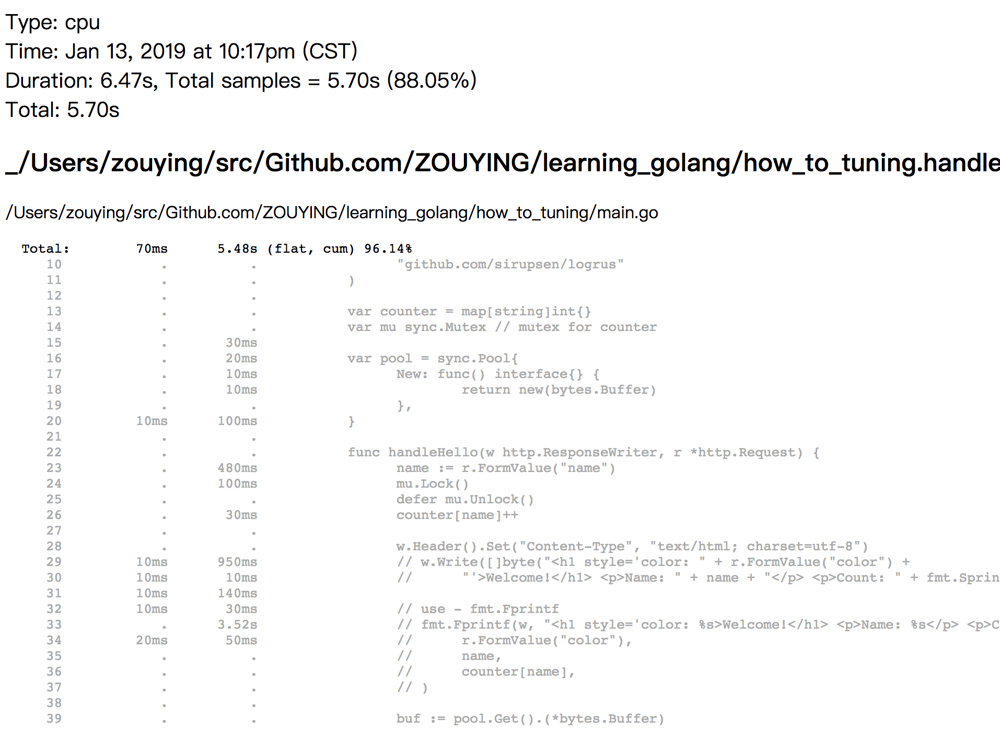


## Memory 调优


运行压测程序时，加入`-memprofile`参数。

```bash
➜  how_to_tuning git:(master) ✗ go test -bench . -memprofile=/tmp/mem.prof
goos: darwin
goarch: amd64
BenchmarkHandleFunc-8             300000              5699 ns/op            1411 B/op         25 allocs/op
PASS
ok      _/Users/zouying/src/Github.com/ZOUYING/learning_golang/how_to_tuning    1.827s
```


使用`go tool pprof /tmp/mem.prof`打开内存压测情况。默认打开的是`alloc_space`类型的内存状态，表示在这个过程中，申请了内存的情况。也可以带`--inuse_objects`查看内存使用情况。

```bash
➜  how_to_tuning git:(master) ✗ go tool pprof /tmp/mem.prof
Type: alloc_space
Time: Jan 13, 2019 at 9:22pm (CST)
Entering interactive mode (type "help" for commands, "o" for options)
```


使用`topN`或者`topN -cum`查看细节，

```bash
(pprof) top
Showing nodes accounting for 395.56MB, 96.58% of 409.56MB total
Showing top 10 nodes out of 25
      flat  flat%   sum%        cum   cum%
  114.52MB 27.96% 27.96%   114.52MB 27.96%  github.com/sirupsen/logrus.(*Entry).WithFields
   77.02MB 18.81% 46.77%    77.02MB 18.81%  bytes.makeSlice
   54.50MB 13.31% 60.08%    97.01MB 23.69%  github.com/sirupsen/logrus.(*TextFormatter).Format
   54.50MB 13.31% 73.38%   409.56MB   100%  _/Users/zouying/src/Github.com/ZOUYING/learning_golang/how_to_tuning.handleHello
      31MB  7.57% 80.95%   128.01MB 31.26%  github.com/sirupsen/logrus.Entry.log
      17MB  4.15% 85.11%       17MB  4.15%  github.com/sirupsen/logrus.(*Logger).releaseEntry
      16MB  3.91% 89.01%       16MB  3.91%  fmt.Sprintf
      14MB  3.42% 92.43%       14MB  3.42%  time.Time.Format
    9.50MB  2.32% 94.75%     9.50MB  2.32%  fmt.Sprint
    7.50MB  1.83% 96.58%     7.50MB  1.83%  sort.Strings
(pprof) top -cum
Showing nodes accounting for 205.03MB, 50.06% of 409.56MB total
Showing top 10 nodes out of 25
      flat  flat%   sum%        cum   cum%
         0     0%     0%   409.56MB   100%  _/Users/zouying/src/Github.com/ZOUYING/learning_golang/how_to_tuning.BenchmarkHandleFunc
   54.50MB 13.31% 13.31%   409.56MB   100%  _/Users/zouying/src/Github.com/ZOUYING/learning_golang/how_to_tuning.handleHello
         0     0% 13.31%   409.56MB   100%  testing.(*B).launch
         0     0% 13.31%   409.56MB   100%  testing.(*B).runN
       5MB  1.22% 14.53%   137.01MB 33.45%  github.com/sirupsen/logrus.(*Entry).Infof
         0     0% 14.53%   131.52MB 32.11%  github.com/sirupsen/logrus.(*Logger).WithFields
         0     0% 14.53%   131.52MB 32.11%  github.com/sirupsen/logrus.WithFields
         0     0% 14.53%   128.51MB 31.38%  github.com/sirupsen/logrus.(*Entry).Info
      31MB  7.57% 22.10%   128.01MB 31.26%  github.com/sirupsen/logrus.Entry.log
  114.52MB 27.96% 50.06%   114.52MB 27.96%  github.com/sirupsen/logrus.(*Entry).WithFields
```


使用`list`查看具体每一行的情况，

```bash
(pprof) list BenchmarkHandleFunc
Total: 409.56MB
ROUTINE ======================== _/Users/zouying/src/Github.com/ZOUYING/learning_golang/how_to_tuning.BenchmarkHandleFunc in /Users/zouying/src/Github.com/ZOUYING/learning_golang/how_to_tuning/main_test.go
         0   409.56MB (flat, cum)   100% of Total
         .          .     16:
         .          .     17:   rw := httptest.NewRecorder()
         .          .     18:   req := httptest.NewRequest(http.MethodPost, "/hello?name=zouying", nil)
         .          .     19:
         .          .     20:   for i := 0; i < b.N; i++ {
         .   409.56MB     21:           handleHello(rw, req)
         .          .     22:   }
         .          .     23:}
(pprof) list handleHello
Total: 409.56MB
ROUTINE ======================== _/Users/zouying/src/Github.com/ZOUYING/learning_golang/how_to_tuning.handleHello in /Users/zouying/src/Github.com/ZOUYING/learning_golang/how_to_tuning/main.go
   54.50MB   409.56MB (flat, cum)   100% of Total
         .          .     16:   mu.Lock()
         .          .     17:   counter[name]++
         .          .     18:   cnt := counter[name]
         .          .     19:   mu.Unlock()
         .          .     20:
         .     5.50MB     21:   w.Header().Set("Content-Type", "text/html; charset=utf-8")
      25MB   102.02MB     22:   w.Write([]byte("<h1 style='color: " + r.FormValue("color") +
   24.50MB    28.50MB     23:           "'>Welcome!</h1> <p>Name: " + name + "</p> <p>Count: " + fmt.Sprint(cnt) + "</p>"))
         .          .     24:
         .   131.52MB     25:   logrus.WithFields(logrus.Fields{
         .          .     26:           "module": "main",
    3.50MB     3.50MB     27:           "name":   name,
    1.50MB     1.50MB     28:           "count":  cnt,
         .   137.01MB     29:   }).Infof("visited")
         .          .     30:}
         .          .     31:
         .          .     32:func main() {
         .          .     33:   logrus.SetFormatter(&logrus.JSONFormatter{})
         .          .     34:
```


也可以根据之前的`web`产出的图，查看底层`Format`具体消耗在什么地方，

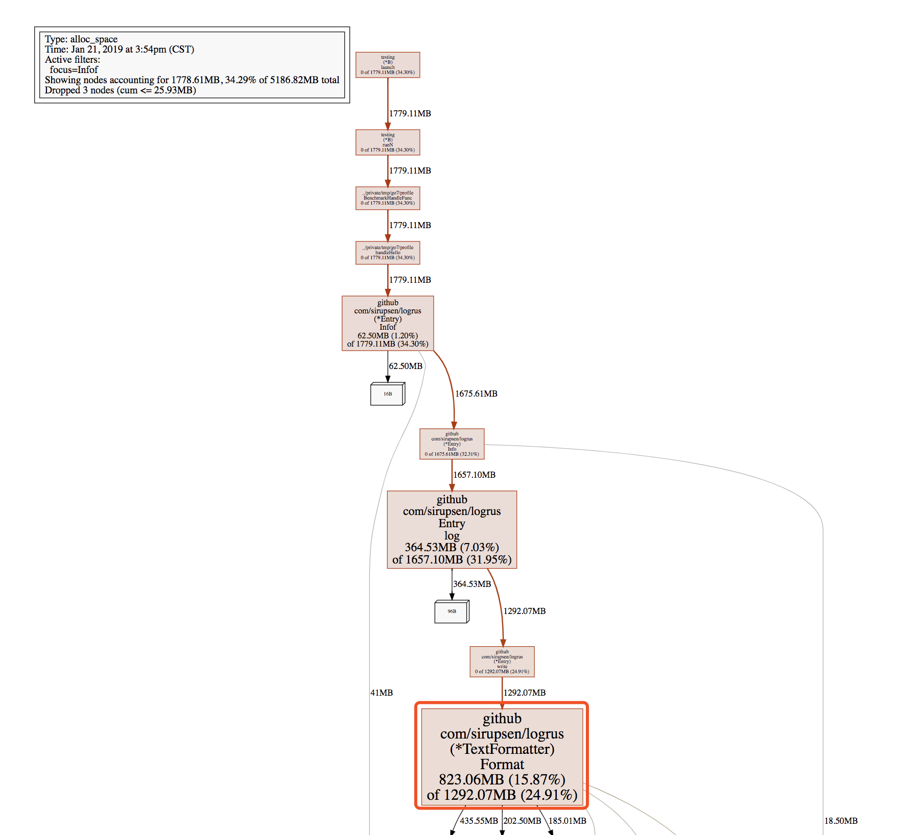

使用`list Format`打开，

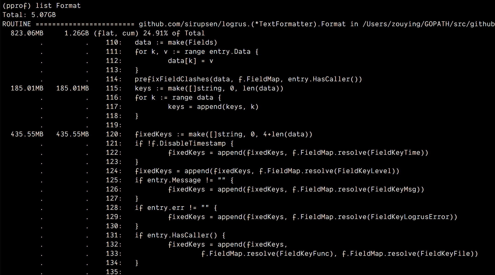


## 调优开始


运行命令：运行压测时间稍微长一些，使用`-benchtime`可以设置压测时间，使得采样更加充分。默认压测时间为1s。

```bash
➜  how_to_tuning git:(master) ✗ go test -bench . -benchtime=3s -cpuprofile=/tmp/cpu.prof -memprofile=/tmp/mem.prof | tee 1_orig.txt
goos: darwin
goarch: amd64
BenchmarkHandleFunc-8            1000000              5403 ns/op            1307 B/op         25 allocs/op
PASS
ok      _/Users/zouying/src/Github.com/ZOUYING/learning_golang/how_to_tuning    5.699s
```


调优前运行的结果保存在`1_orig.txt`文件中，一会儿调优可以对比。后面可以使用`benchcmp`工具进行较为直观的观察。

使用`list`获取最需要优化的代码段。

```bash
(pprof) list BenchmarkHandleFunc
Total: 4.69s
ROUTINE ======================== _/Users/zouying/src/Github.com/ZOUYING/learning_golang/how_to_tuning.BenchmarkHandleFunc in /Users/zouying/src/Github.com/ZOUYING/learning_golang/how_to_tuning/main_test.go
      10ms      4.48s (flat, cum) 95.52% of Total
         .          .     15:   logrus.SetOutput(ioutil.Discard)
         .          .     16:
         .          .     17:   rw := httptest.NewRecorder()
         .          .     18:   req := httptest.NewRequest(http.MethodPost, "/hello?name=zouying", nil)
         .          .     19:
      10ms       10ms     20:   for i := 0; i < b.N; i++ {
         .      4.47s     21:           handleHello(rw, req)
         .          .     22:   }
         .          .     23:}

(pprof) list handleHello
Total: 4.88s
ROUTINE ======================== _/Users/zouying/src/Github.com/ZOUYING/learning_golang/how_to_tuning.handleHello in /Users/zouying/src/Github
.com/ZOUYING/learning_golang/how_to_tuning/main.go
      70ms      4.64s (flat, cum) 95.08% of Total
         .          .     10:
         .          .     11:var counter = map[string]int{}
         .          .     12:var mu sync.Mutex // mutex for counter
         .          .     13:
         .          .     14:func handleHello(w http.ResponseWriter, r *http.Request) {
      10ms       40ms     15:   name := r.FormValue("name")
         .          .     16:   mu.Lock()
         .       10ms     17:   defer mu.Unlock()
         .       10ms     18:   counter[name]++
         .          .     19:
         .      170ms     20:   w.Header().Set("Content-Type", "text/html; charset=utf-8")
      10ms      310ms     21:   w.Write([]byte("<h1 style='color: " + r.FormValue("color") +
      10ms      250ms     22:           "'>Welcome!</h1> <p>Name: " + name + "</p> <p>Count: " + fmt.Sprint(counter[name]) + "</p>"))
         .          .     23:
      30ms      740ms     24:   logrus.WithFields(logrus.Fields{
      10ms       50ms     25:           "module": "main",
         .      120ms     26:           "name":   name,
         .       80ms     27:           "count":  counter[name],
         .      2.85s     28:   }).Infof("visited")
         .       10ms     29:}
         .          .     30:
         .          .     31:func main() {
         .          .     32:   logrus.SetFormatter(&logrus.JSONFormatter{})
         .          .     33:
         .          .     34:   http.HandleFunc("/hello", handleHello)
```


查看内存情况，

```bash
➜  how_to_tuning git:(master) ✗ go tool pprof /tmp/mem.prof
Type: alloc_space
Time: Jan 13, 2019 at 9:34pm (CST)
Entering interactive mode (type "help" for commands, "o" for options)
(pprof) list handleHello
Total: 1.26GB
ROUTINE ======================== _/Users/zouying/src/Github.com/ZOUYING/learning_golang/how_to_tuning.handleHello in /Users/zouying/src/Github
.com/ZOUYING/learning_golang/how_to_tuning/main.go
  185.51MB     1.26GB (flat, cum) 99.63% of Total
         .          .     16:   mu.Lock()
         .          .     17:   counter[name]++
         .          .     18:   cnt := counter[name]
         .          .     19:   mu.Unlock()
         .          .     20:
         .    11.50MB     21:   w.Header().Set("Content-Type", "text/html; charset=utf-8")
   87.51MB   238.09MB     22:   w.Write([]byte("<h1 style='color: " + r.FormValue("color") +
   83.01MB    87.51MB     23:           "'>Welcome!</h1> <p>Name: " + name + "</p> <p>Count: " + fmt.Sprint(cnt) + "</p>"))
         .          .     24:
         .   481.59MB     25:   logrus.WithFields(logrus.Fields{
         .          .     26:           "module": "main",
   11.50MB    11.50MB     27:           "name":   name,
    3.50MB     3.50MB     28:           "count":  cnt,
         .   456.03MB     29:   }).Infof("visited")
         .          .     30:}
         .          .     31:
         .          .     32:func main() {
         .          .     33:   logrus.SetFormatter(&logrus.JSONFormatter{})
         .          .     34:
```


可以发现有2个点需要重点优化，

- logrus的日志输出；
- w.Write()写响应结果；


使用`fmt.Sprintf`而不是使用字符串拼接的方式。

```go
	fmt.Fprintf(w, "<h1 style='color: %s>Welcome!</h1> <p>Name: %s</p> <p>Count: %d</p>",
		r.FormValue("color"),
		name,
		counter[name],
	)
```


运行压测：

```bash
➜  how_to_tuning git:(master) ✗ go test -bench . -benchtime=3s -cpuprofile=/tmp/2_cpu.prof -memprofile=/tmp/2_mem.prof | tee 2_fmtf.txt
goos: darwin
goarch: amd64
BenchmarkHandleFunc-8            1000000              6325 ns/op            1153 B/op         23 allocs/op
PASS
ok      _/Users/zouying/src/Github.com/ZOUYING/learning_golang/how_to_tuning    6.516s
```


运行`benchcmp`工具对比调优结果：

```bash
➜  how_to_tuning git:(master) ✗ benchcmp 1_orig.txt 2_fmtf.txt
benchmark                 old ns/op     new ns/op     delta
BenchmarkHandleFunc-8     5403          6325          +17.06%

benchmark                 old allocs     new allocs     delta
BenchmarkHandleFunc-8     25             23             -8.00%

benchmark                 old bytes     new bytes     delta
BenchmarkHandleFunc-8     1307          1153          -11.78%
```


打开profile文件，

```bash
➜  how_to_tuning git:(master) ✗ go tool pprof /tmp/2_cpu.prof
Type: cpu
Time: Jan 13, 2019 at 10:17pm (CST)
Duration: 6.47s, Total samples = 5.70s (88.05%)
Entering interactive mode (type "help" for commands, "o" for options)
(pprof) list handleHello
Total: 5.70s
ROUTINE ======================== _/Users/zouying/src/Github.com/ZOUYING/learning_golang/how_to_tuning.handleHello in /Users/zouying/src/Github.com/ZOUYING/learning_golang/how_to_tuning/main.go
      70ms      5.48s (flat, cum) 96.14% of Total
         .          .     10:
         .          .     11:var counter = map[string]int{}
         .          .     12:var mu sync.Mutex // mutex for counter
         .          .     13:
         .          .     14:func handleHello(w http.ResponseWriter, r *http.Request) {
         .       30ms     15:   name := r.FormValue("name")
         .       20ms     16:   mu.Lock()
         .       10ms     17:   defer mu.Unlock()
         .       10ms     18:   counter[name]++
         .          .     19:
      10ms      100ms     20:   w.Header().Set("Content-Type", "text/html; charset=utf-8")
         .          .     21:   // w.Write([]byte("<h1 style='color: " + r.FormValue("color") +
         .          .     22:   //      "'>Welcome!</h1> <p>Name: " + name + "</p> <p>Count: " + fmt.Sprint(counter[name]) + "</p>"))
         .      480ms     23:   fmt.Fprintf(w, "<h1 style='color: %s>Welcome!</h1> <p>Name: %s</p> <p>Count: %d</p>",
         .      100ms     24:           r.FormValue("color"),
         .          .     25:           name,
         .       30ms     26:           counter[name],
         .          .     27:   )
         .          .     28:
      10ms      950ms     29:   logrus.WithFields(logrus.Fields{
      10ms       10ms     30:           "module": "main",
      10ms      140ms     31:           "name":   name,
      10ms       30ms     32:           "count":  counter[name],
         .      3.52s     33:   }).Infof("visited")
      20ms       50ms     34:}
         .          .     35:
         .          .     36:func main() {
         .          .     37:   logrus.SetFormatter(&logrus.JSONFormatter{})
         .          .     38:
         .          .     39:   http.HandleFunc("/hello", handleHello)
```


```bash
➜  how_to_tuning git:(master) ✗ go tool pprof /tmp/2_mem.prof
Type: alloc_space
Time: Jan 13, 2019 at 10:18pm (CST)
Entering interactive mode (type "help" for commands, "o" for options)
(pprof) list handleHello
Total: 1.10GB
ROUTINE ======================== _/Users/zouying/src/Github.com/ZOUYING/learning_golang/how_to_tuning.handleHello in /Users/zouying/src/Github.com/ZOUYING/learning_golang/how_to_tuning/main.go
   39.50MB     1.09GB (flat, cum) 99.68% of Total
         .          .     15:   name := r.FormValue("name")
         .          .     16:   mu.Lock()
         .          .     17:   defer mu.Unlock()
         .          .     18:   counter[name]++
         .          .     19:
         .    14.50MB     20:   w.Header().Set("Content-Type", "text/html; charset=utf-8")
         .          .     21:   // w.Write([]byte("<h1 style='color: " + r.FormValue("color") +
         .          .     22:   //      "'>Welcome!</h1> <p>Name: " + name + "</p> <p>Count: " + fmt.Sprint(counter[name]) + "</p>"))
         .   149.77MB     23:   fmt.Fprintf(w, "<h1 style='color: %s>Welcome!</h1> <p>Name: %s</p> <p>Count: %d</p>",
      15MB       15MB     24:           r.FormValue("color"),
         .          .     25:           name,
    3.50MB     3.50MB     26:           counter[name],
         .          .     27:   )
         .          .     28:
         .   474.59MB     29:   logrus.WithFields(logrus.Fields{
         .          .     30:           "module": "main",
   17.50MB    17.50MB     31:           "name":   name,
    3.50MB     3.50MB     32:           "count":  counter[name],
         .   442.03MB     33:   }).Infof("visited")
         .          .     34:}
         .          .     35:
         .          .     36:func main() {
         .          .     37:   logrus.SetFormatter(&logrus.JSONFormatter{})
         .          .     38:
```


优化的最佳实践之一：避免内存重复申请/释放开销。

使用[sync/Pool](https://golang.org/pkg/sync/#Pool)作为cache进行优化。

```
A Pool is a set of temporary objects that may be individually saved and retrieved.

Any item stored in the Pool may be removed automatically at any time without notification. If the Pool holds the only reference when this happens, the item might be deallocated.

A Pool is safe for use by multiple goroutines simultaneously.

Pool's purpose is to cache allocated but unused items for later reuse, relieving pressure on the garbage collector. That is, it makes it easy to build efficient, thread-safe free lists. However, it is not suitable for all free lists.

An appropriate use of a Pool is to manage a group of temporary items silently shared among and potentially reused by concurrent independent clients of a package. Pool provides a way to amortize allocation overhead across many clients.

An example of good use of a Pool is in the fmt package, which maintains a dynamically-sized store of temporary output buffers. The store scales under load (when many goroutines are actively printing) and shrinks when quiescent.

On the other hand, a free list maintained as part of a short-lived object is not a suitable use for a Pool, since the overhead does not amortize well in that scenario. It is more efficient to have such objects implement their own free list.

A Pool must not be copied after first use.
```

注意文档中所列的需要注意的事项。


**工作中遇到过的生产问题：使用logrus进行日志输出**

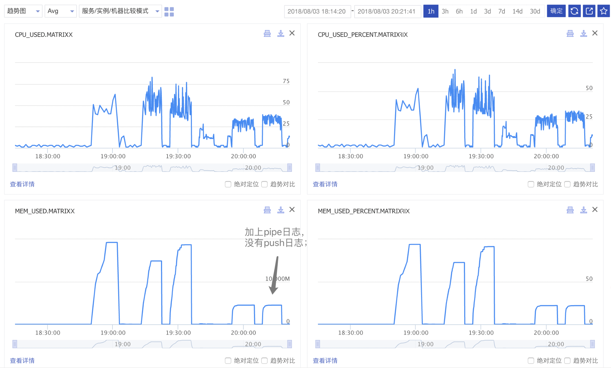


查看`top`：

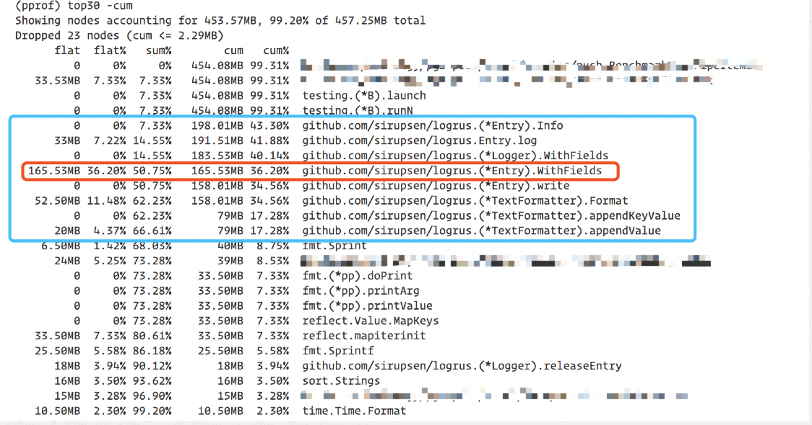


查看WithFields为什么消耗这么多，发现在函数中产生大量的赋值操作： 


[logrus - issues 125: Improving logrus performance](https://github.com/Sirupsen/logrus/issues/125)

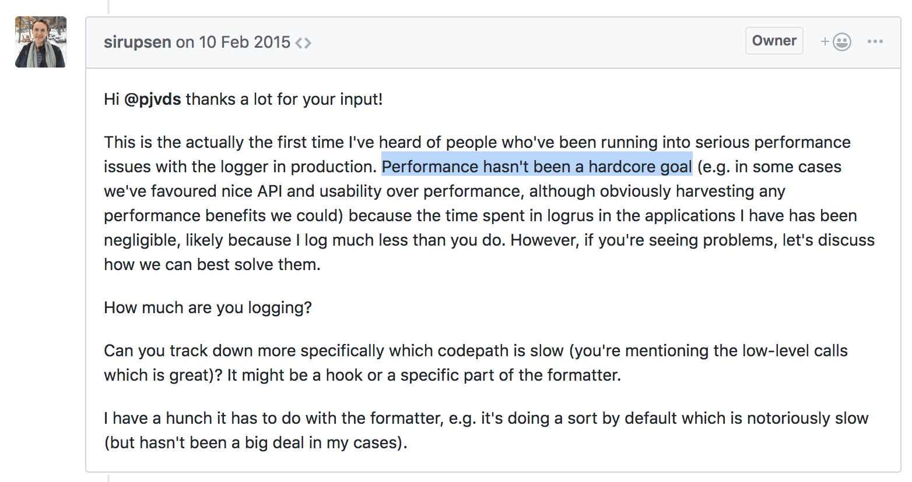


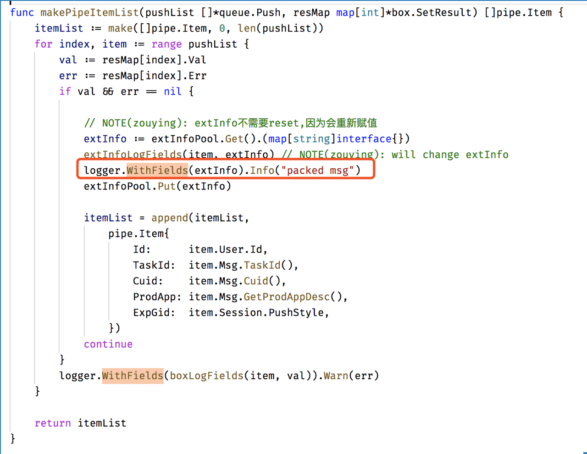

INFO日志语句修改为直接输出有效信息：

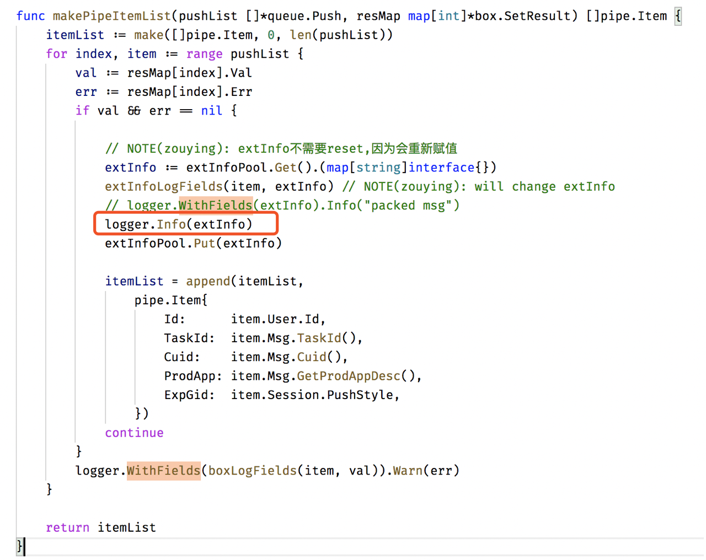

优化后，

- 内存从`18.7GB`优化到了`4.5GB`


使用示例：

```go
package main

import (
	"bytes"
	"io"
	"os"
	"sync"
	"time"
)

var bufPool = sync.Pool{
	New: func() interface{} {
		// The Pool's New function should generally only return pointer
		// types, since a pointer can be put into the return interface
		// value without an allocation:
		return new(bytes.Buffer)
	},
}

// timeNow is a fake version of time.Now for tests.
func timeNow() time.Time {
	return time.Unix(1136214245, 0)
}

func Log(w io.Writer, key, val string) {
	b := bufPool.Get().(*bytes.Buffer)
	b.Reset()
	// Replace this with time.Now() in a real logger.
	b.WriteString(timeNow().UTC().Format(time.RFC3339))
	b.WriteByte(' ')
	b.WriteString(key)
	b.WriteByte('=')
	b.WriteString(val)
	w.Write(b.Bytes())
	bufPool.Put(b)
}

func main() {
	Log(os.Stdout, "path", "/search?q=flowers")
}
```


在我们的压测中，使用`sync.Pool`优化，写ResponseWrite响应的代码段。

```bash
	buf := pool.Get().(*bytes.Buffer)
	defer pool.Put(buf)
	buf.Reset()
	buf.Write([]byte("<h1 style='color: "))
	buf.Write([]byte(r.FormValue("color")))
	buf.Write([]byte("'>Welcome!</h1> <p>Name: "))
	buf.Write([]byte(name))
	buf.Write([]byte("</p> <p>Count: "))
	b := strconv.AppendInt(buf.Bytes(), int64(counter[name]), 10)
	b = append(b, []byte("</p>")...)
	w.Write(b)
```


运行压测：

```bash
➜  how_to_tuning git:(master) ✗ go test -bench . -benchtime=3s -cpuprofile=/tmp/3_cpu.prof -memprofile=/tmp/3_mem.prof | tee 3_sync_pool_write.txt
goos: darwin
goarch: amd64
BenchmarkHandleFunc-8            1000000              4203 ns/op            1131 B/op         21 allocs/op
PASS
ok      _/Users/zouying/src/Github.com/ZOUYING/learning_golang/how_to_tuning    4.448s
```


与前一次的优化进行比较，

```bash
➜  how_to_tuning git:(master) ✗ benchcmp 2_fmtf.txt 3_sync_pool_write.txt
benchmark                 old ns/op     new ns/op     delta
BenchmarkHandleFunc-8     6325          4203          -33.55%

benchmark                 old allocs     new allocs     delta
BenchmarkHandleFunc-8     23             21             -8.70%

benchmark                 old bytes     new bytes     delta
BenchmarkHandleFunc-8     1153          1131          -1.91%
```


查看`list handleHello`内存申请情况：

```bash
➜  how_to_tuning git:(master) ✗ go tool pprof /tmp/3_mem.prof
Type: alloc_space
Time: Jan 13, 2019 at 10:41pm (CST)
Entering interactive mode (type "help" for commands, "o" for options)
(pprof) list handleHello
Total: 1.07GB
ROUTINE ======================== _/Users/zouying/src/Github.com/ZOUYING/learning_golang/how_to_tuning.handleHello in /Users/zouying/src/Github.com/ZOUYING/learning_golang/how_to_tuning/m
ain.go
      24MB     1.07GB (flat, cum) 99.71% of Total
         .          .     22:   name := r.FormValue("name")
         .          .     23:   mu.Lock()
         .          .     24:   defer mu.Unlock()
         .          .     25:   counter[name]++
         .          .     26:
         .    19.50MB     27:   w.Header().Set("Content-Type", "text/html; charset=utf-8")
         .          .     28:   // w.Write([]byte("<h1 style='color: " + r.FormValue("color") +
         .          .     29:   //      "'>Welcome!</h1> <p>Name: " + name + "</p> <p>Count: " + fmt.Sprint(counter[name]) + "</p>"))
         .          .     30:
         .          .     31:   // use - fmt.Fprintf
         .          .     32:   // fmt.Fprintf(w, "<h1 style='color: %s>Welcome!</h1> <p>Name: %s</p> <p>Count: %d</p>",
         .          .     33:   //      r.FormValue("color"),
         .          .     34:   //      name,
         .          .     35:   //      counter[name],
         .          .     36:   // )
         .          .     37:
         .          .     38:   buf := pool.Get().(*bytes.Buffer)
         .          .     39:   defer pool.Put(buf)
         .          .     40:   buf.Reset()
         .          .     41:   buf.Write([]byte("<h1 style='color: "))
         .          .     42:   buf.Write([]byte(r.FormValue("color")))
         .          .     43:   buf.Write([]byte("'>Welcome!</h1> <p>Name: "))
         .          .     44:   buf.Write([]byte(name))
         .          .     45:   buf.Write([]byte("</p> <p>Count: "))
         .          .     46:   b := strconv.AppendInt(buf.Bytes(), int64(counter[name]), 10)
         .          .     47:   b = append(b, []byte("</p>")...)
         .   150.59MB     48:   w.Write(b)
         .          .     49:
         .   449.09MB     50:   logrus.WithFields(logrus.Fields{
         .          .     51:           "module": "main",
   16.50MB    16.50MB     52:           "name":   name,
    7.50MB     7.50MB     53:           "count":  counter[name],
         .   453.53MB     54:   }).Infof("visited")
         .          .     55:}
         .          .     56:
         .          .     57:func main() {
         .          .     58:   logrus.SetFormatter(&logrus.JSONFormatter{})
         .          .     59:
(pprof)
```


日志优化，

```bash
➜  how_to_tuning git:(master) ✗ go run main.go
{"count":1,"level":"info","module":"main","msg":"visited","name":"zouying","time":"2019-01
-13T22:40:06+08:00"}
{"count":2,"level":"info","module":"main","msg":"visited","name":"zouying","time":"2019-01-13T22:40:10+08:00"}
```


在profile分析中，输出日志的问题：

消耗CPU和Mem都是大头：

CPU：

```bash
         .      730ms     50:   logrus.WithFields(logrus.Fields{
         .       30ms     51:           "module": "main",
      10ms      110ms     52:           "name":   name,
         .       30ms     53:           "count":  counter[name],
         .      2.02s     54:   }).Infof("visited")
      10ms       40ms     55:}
```


Mem：

```bash
         .   449.09MB     50:   logrus.WithFields(logrus.Fields{
         .          .     51:           "module": "main",
   16.50MB    16.50MB     52:           "name":   name,
    7.50MB     7.50MB     53:           "count":  counter[name],
         .   453.53MB     54:   }).Infof("visited")
```


日志输出段代码，

```bash
	logbuf := pool.Get().(*bytes.Buffer)
	logbuf.Reset()
	logbuf.WriteString(fmt.Sprintf("visited name=%s count=%d", name, counter[name]))
	logrus.Info(logbuf.String())
	pool.Put(logbuf)
```


日志效果，

```bash
➜  how_to_tuning git:(master) ✗ go run main.go
{"level":"info","msg":"visited name=eden count=1","time":"2019-01-13T23:02:07+08:00"}
{"level":"info","msg":"visited name=zouying count=1","time":"2019-01-13T23:02:11+08:00"}
{"level":"info","msg":"visited name=zouying count=2","time":"2019-01-13T23:02:12+08:00"}
{"level":"info","msg":"visited name=zouying count=3","time":"2019-01-13T23:02:13+08:00"}
```


运行压测，

```bash
➜  how_to_tuning git:(master) ✗ go test -bench . -benchtime=3s -cpuprofile=/tmp/5_cpu.prof -memprofile=/tmp/5_mem.prof | tee 5_sync_pool_log.txt
goos: darwin
goarch: amd64
BenchmarkHandleFunc-8            1000000              3421 ns/op             783 B/op         19 allocs/op
PASS
ok      _/Users/zouying/src/Github.com/ZOUYING/learning_golang/how_to_tuning    3.614s
```

比较，

```bash
➜  how_to_tuning git:(master) ✗ benchcmp 4_sync_pool_writestring.txt 5_sync_pool_log.txt
benchmark                 old ns/op     new ns/op     delta
BenchmarkHandleFunc-8     3999          3421          -14.45%

benchmark                 old allocs     new allocs     delta
BenchmarkHandleFunc-8     21             19             -9.52%

benchmark                 old bytes     new bytes     delta
BenchmarkHandleFunc-8     1131          783           -30.77%
```


CPU日志输出：

```bash
         .          .     51:   logbuf := pool.Get().(*bytes.Buffer)
         .          .     52:   logbuf.Reset()
         .      280ms     53:   logbuf.WriteString(fmt.Sprintf("visited name=%s count=%d", name, counter[name]))
         .      2.28s     54:   logrus.Info(logbuf.String())
      10ms       30ms     55:   pool.Put(logbuf)
```

logrus日志输出时，内存使用情况，

```bash
         .          .     51:   logbuf := pool.Get().(*bytes.Buffer)
         .          .     52:   logbuf.Reset()
      20MB       61MB     53:   logbuf.WriteString(fmt.Sprintf("visited name=%s count=%d", name, counter[name]))
      16MB   527.53MB     54:   logrus.Info(logbuf.String())
         .          .     55:   pool.Put(logbuf)
```


优化结束后，与最初的性能比对情况。

```bash
➜  how_to_tuning git:(master) ✗ benchcmp 1_orig.txt 5_sync_pool_log.txt
benchmark                 old ns/op     new ns/op     delta
BenchmarkHandleFunc-8     5403          3421          -36.68%

benchmark                 old allocs     new allocs     delta
BenchmarkHandleFunc-8     25             19             -24.00%

benchmark                 old bytes     new bytes     delta
BenchmarkHandleFunc-8     1307          783           -40.09%
```


目前`topN`显示，

```bash
(pprof) top -cum
Showing nodes accounting for 0.50s, 3.48% of 14.38s total
Dropped 120 nodes (cum <= 0.07s)
Showing top 10 nodes out of 103
      flat  flat%   sum%        cum   cum%
     0.04s  0.28%  0.28%     13.84s 96.24%  _/Users/zouying/src/Github.com/ZOUYING/learning_golang/how_to_tuning.BenchmarkHandleFunc
         0     0%  0.28%     13.84s 96.24%  testing.(*B).launch
         0     0%  0.28%     13.84s 96.24%  testing.(*B).runN
     0.18s  1.25%  1.53%     13.80s 95.97%  _/Users/zouying/src/Github.com/ZOUYING/learning_golang/how_to_tuning.handleHello
     0.01s  0.07%  1.60%     10.36s 72.04%  github.com/sirupsen/logrus.Infof
     0.03s  0.21%  1.81%     10.35s 71.97%  github.com/sirupsen/logrus.(*Logger).Infof
     0.06s  0.42%  2.23%      9.90s 68.85%  github.com/sirupsen/logrus.(*Entry).Infof
     0.06s  0.42%  2.64%      9.22s 64.12%  github.com/sirupsen/logrus.(*Entry).Info
     0.11s  0.76%  3.41%      8.95s 62.24%  github.com/sirupsen/logrus.Entry.log
     0.01s  0.07%  3.48%      7.61s 52.92%  github.com/sirupsen/logrus.(*Entry).write
(pprof)
```


优化日志输出：`logrus.Infof`日志输出占用了72.04%；


选取新的日志库，

Log a message and 10 fields:

| Library         | Time        | Bytes Allocated | Objects Allocated |
| --------------- | ----------- | --------------- | ----------------- |
| zerolog         | 767 ns/op   | 552 B/op        | 6 allocs/op       |
| ⚡️ zap           | 848 ns/op   | 704 B/op        | 2 allocs/op       |
| ⚡️ zap (sugared) | 1363 ns/op  | 1610 B/op       | 20 allocs/op      |
| go-kit          | 3614 ns/op  | 2895 B/op       | 66 allocs/op      |
| lion            | 5392 ns/op  | 5807 B/op       | 63 allocs/op      |
| logrus          | 5661 ns/op  | 6092 B/op       | 78 allocs/op      |
| apex/log        | 15332 ns/op | 3832 B/op       | 65 allocs/op      |
| log15           | 20657 ns/op | 5632 B/op       | 93 allocs/op      |

Log a static string, without any context or `printf`-style templating:

| Library          | Time       | Bytes Allocated | Objects Allocated |
| ---------------- | ---------- | --------------- | ----------------- |
| zerolog          | 50 ns/op   | 0 B/op          | 0 allocs/op       |
| ⚡️ zap            | 236 ns/op  | 0 B/op          | 0 allocs/op       |
| standard library | 453 ns/op  | 80 B/op         | 2 allocs/op       |
| ⚡️ zap (sugared)  | 337 ns/op  | 80 B/op         | 2 allocs/op       |
| go-kit           | 508 ns/op  | 656 B/op        | 13 allocs/op      |
| lion             | 771 ns/op  | 1224 B/op       | 10 allocs/op      |
| logrus           | 1244 ns/op | 1505 B/op       | 27 allocs/op      |
| apex/log         | 2751 ns/op | 584 B/op        | 11 allocs/op      |
| log15            | 5181 ns/op | 1592 B/op       | 26 allocs/op      |

使用`zerolog`输出日志：

```go
// 定义zerolog日志对象，输出到Discard中
var logger zerolog.Logger
logger = zerolog.New(ioutil.Discard)

logger.Info().Msg(logbuf.String())  // 输出日志
```


```go
➜  how_to_tuning git:(master) ✗ go test -bench . -benchtime=10s -cpuprofile=/tmp/7_cpu.pro
f -memprofile=/tmp/7_mem.prof | tee 7_zerolog_string.txt
goos: darwin
goarch: amd64
BenchmarkHandleFunc-8           20000000              1077 ns/op             391 B/op          5 allocs/op
PASS
ok      _/Users/zouying/src/Github.com/ZOUYING/learning_golang/how_to_tuning    23.048s
```


## GC优化


查看目前的top，

```bash
➜  learning_golang git:(master) ✗ go tool pprof /tmp/5_cpu.prof
Type: cpu
Time: Jan 13, 2019 at 11:05pm (CST)
Duration: 3.58s, Total samples = 3.07s (85.87%)
Entering interactive mode (type "help" for commands, "o" for options)
(pprof) top
Showing nodes accounting for 1750ms, 57.00% of 3070ms total
Dropped 36 nodes (cum <= 15.35ms)
Showing top 10 nodes out of 113
      flat  flat%   sum%        cum   cum%
     470ms 15.31% 15.31%      470ms 15.31%  runtime.(*mspan).refillAllocCache
     240ms  7.82% 23.13%      240ms  7.82%  runtime.(*mspan).init (inline)
     190ms  6.19% 29.32%     1320ms 43.00%  runtime.mallocgc
     150ms  4.89% 34.20%      150ms  4.89%  runtime.memclrNoHeapPointers
     150ms  4.89% 39.09%      150ms  4.89%  runtime.memmove
     150ms  4.89% 43.97%      280ms  9.12%  strconv.appendEscapedRune
     150ms  4.89% 48.86%      430ms 14.01%  strconv.appendQuotedWith
      90ms  2.93% 51.79%       90ms  2.93%  time.nextStdChunk
      80ms  2.61% 54.40%       80ms  2.61%  runtime.heapBitsSetType
      80ms  2.61% 57.00%      240ms  7.82%  time.Time.AppendFormat
```


和之前优化进行比对，

```bash
➜  how_to_tuning git:(master) ✗ benchcmp 6_.txt 7_zerolog_string.txt
benchmark                 old ns/op     new ns/op     delta
BenchmarkHandleFunc-8     3421          1077          -68.52%

benchmark                 old allocs     new allocs     delta
BenchmarkHandleFunc-8     19             5              -73.68%

benchmark                 old bytes     new bytes     delta
BenchmarkHandleFunc-8     783           391           -50.06%
```


和优化前进行比对，

```bash
➜  how_to_tuning git:(master) ✗ benchcmp 1_.txt 7_zerolog_string.txt
benchmark                 old ns/op     new ns/op     delta
BenchmarkHandleFunc-8     5403          1077          -80.07%

benchmark                 old allocs     new allocs     delta
BenchmarkHandleFunc-8     25             5              -80.00%

benchmark                 old bytes     new bytes     delta
BenchmarkHandleFunc-8     1307          391           -70.08%
```


查看`profile topN`，

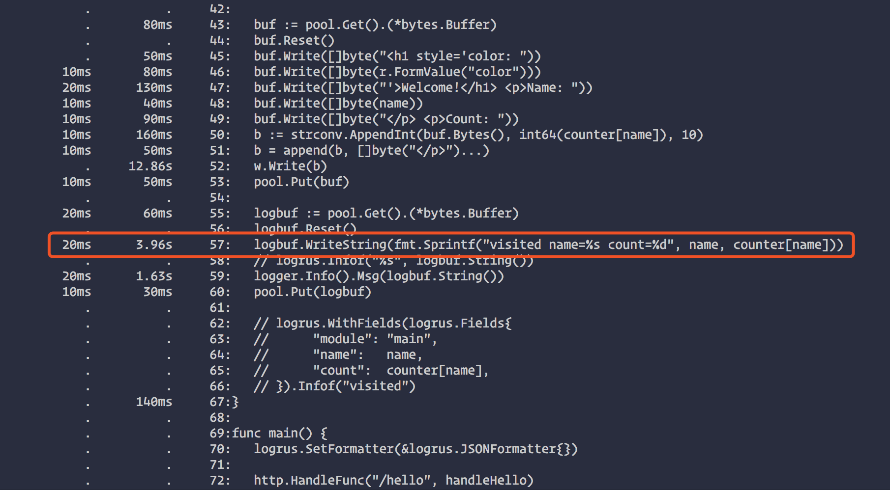

将`fmt.Sprintf`替换为`bytes.Buffer.Write()`，

```bash
➜  how_to_tuning git:(master) ✗ go test -bench . -benchtime=10s -cpuprofile=/tmp/8_cpu.prof -memprofile=/tmp/8_mem.prof | tee 8_fmt_sprintf_to_bytes_write.txt
goos: darwin
goarch: amd64
BenchmarkHandleFunc-8           20000000               796 ns/op             303 B/op          2 allocs/op
PASS
ok      _/Users/zouying/src/Github.com/ZOUYING/learning_golang/how_to_tuning    17.168s
```


优化后，


与之前的比对，

```bash
➜  how_to_tuning git:(master) ✗ benchcmp 7_zerolog_string.txt 8_fmt_sprintf_to_bytes_write.txt
benchmark                 old ns/op     new ns/op     delta
BenchmarkHandleFunc-8     1077          796           -26.09%

benchmark                 old allocs     new allocs     delta
BenchmarkHandleFunc-8     5              2              -60.00%

benchmark                 old bytes     new bytes     delta
BenchmarkHandleFunc-8     391           303           -22.51%
```


与第一次比对，

```bash
➜  how_to_tuning git:(master) ✗ benchcmp 1_.txt 8_fmt_sprintf_to_bytes_write.txt
benchmark                 old ns/op     new ns/op     delta
BenchmarkHandleFunc-8     5403          796           -85.27%

benchmark                 old allocs     new allocs     delta
BenchmarkHandleFunc-8     25             2              -92.00%

benchmark                 old bytes     new bytes     delta
BenchmarkHandleFunc-8     1307          303           -76.82%
```


最终版本

```go

func handleHello(w http.ResponseWriter, r *http.Request) {
	name := r.FormValue("name")
	mu.Lock()
	counter[name]++
	cnt := []byte(strconv.Itoa(counter[name]))
	mu.Unlock()

	buf := pool.Get().(*bytes.Buffer)
	buf.Reset()
	buf.Write([]byte("<h1 style='color: "))
	buf.Write([]byte(r.FormValue("color")))
	buf.Write([]byte("'>Welcome!</h1> <p>Name: "))
	buf.Write([]byte(name))
	buf.Write([]byte("</p> <p>Count: "))
	buf.Write(cnt)
	w.Write(buf.Bytes())
	pool.Put(buf)

	logbuf := pool.Get().(*bytes.Buffer)
	logbuf.Reset()
	logbuf.Write([]byte("visited name="))
	logbuf.Write([]byte(name))
	logbuf.Write([]byte("count="))
	logbuf.Write(cnt)
	logger.Info().Msg(logbuf.String())
	pool.Put(logbuf)
}
```

和优化前的版本比对：

```bash
➜  how_to_tuning git:(master) ✗ benchcmp 1_.txt 10_final.txt
benchmark                 old ns/op     new ns/op     delta
BenchmarkHandleFunc-8     5403          590           -89.08%

benchmark                 old allocs     new allocs     delta
BenchmarkHandleFunc-8     25             2              -92.00%

benchmark                 old bytes     new bytes     delta
BenchmarkHandleFunc-8     1307          217           -83.40%
```


## Best Practice

- 对于频繁分配的小对象，考虑使用`sync.Pool`对象池优化；避免高频分配/GC
- 尽量提前分配slice和map的长度
- 使用`atomic`、`sync.Map`替换sync.Mutex
- 使用第三方库优化：httprouter、encoding/json等等。。。
- 加入`-race`进行`Data Race`检查
- 在IO的地方，考虑引入goroutine，做成异步操作
  - 这一部分会在下一章中介绍goroutine的调优


## 参考

- [golang/pprof](https://golang.org/pkg/runtime/pprof/)
- [golang/profiling-go-programs](https://blog.golang.org/profiling-go-programs)
- [Google 推出 C++ Go Java Scala的基准性能测试](https://www.cnbeta.com/articles/soft/145252.htm)